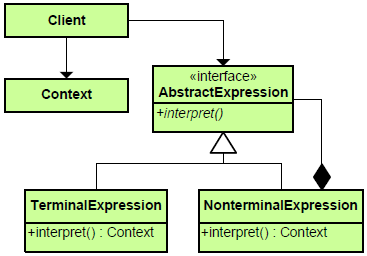
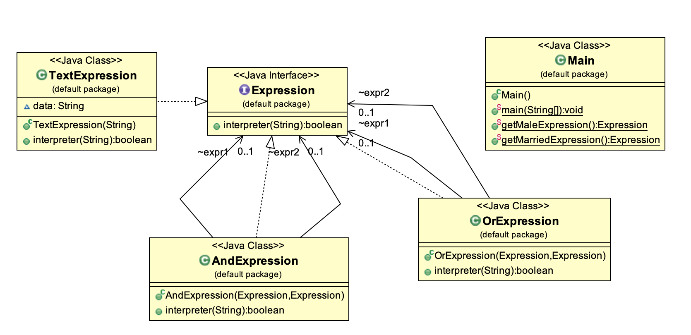
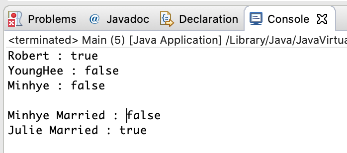

#### Interpreter 패턴의 정의

------

* 어떤 언어에 대해, 언어의 문법에 대한 표현을 정의하면서, 해당 언어로 기술된 문장을 구성하는 방법, 이를 해석하는 해석자를 함께 정의하는 패턴
* 해석이 필요한 언어가 존재하거나, 추상구문 트리로서 그 언어의 문장을 표현하고자 한다면, 해석자 패턴에 적합한 예
* 각 연산에 관련된 클래스들은 각자의 해석방법을 정의.

##### 추상구문트리

* 특정 프로그래밍 언어로 작성된 프로그램 소스코드를 각 의미별로 분리, 컴퓨터가 이해할 수 있는 구조로 변경시킨 트리.


##### 해석자패턴의 UML



* TerminalExpression : 단말노드 Expression. Leaf노드에 해당하는 Expression
* NonTerminalExpression : 비단말노드 Expression

#### 해석자 패턴 예제

------

#### 

```java
public interface Expression {
	boolean interpreter(String con);
}
```

```java
public class TextExpression implements Expression{

	String data;
	
	public TextExpression(String data){
		this.data = data;
	}
	
	@Override
	public boolean interpreter(String context) {
		// TODO Auto-generated method stub
		if(con.contains(data)) return true; 
		else return false;
	}
	
}
```

```java
public class OrExpression implements Expression{

	Expression expr1;
	Expression expr2;
	
	public OrExpression(Expression expr1, Expression expr2){
		this.expr1 = expr1;
		this.expr2 = expr2;
	}
	
	@Override
	public boolean interpreter(String context) {
		// TODO Auto-generated method stub
		return expr1.interpreter(context) || expr2.interpreter(context);
	}
}
```

```java
public class AndExpression implements Expression{

	Expression expr1;
	Expression expr2;
	
	public AndExpression(Expression expr1, Expression expr2){
		this.expr1 = expr1;
		this.expr2 = expr2;
	}
	
	@Override
	public boolean interpreter(String context) {
		// TODO Auto-generated method stub
		return expr1.interpreter(context) && expr2.interpreter(context);
	}
}
```

```java
public class Main {

	public static void main(String[] args) {
		// TODO Auto-generated method stub
		Expression isMale = getMaleExpression();
		Expression isMarried = getMarriedExpression();
		
		System.out.println("Robert : " + isMale.interpreter("Robert"));
		System.out.println("YoungHee : " + isMale.interpreter("YoungHee"));
		System.out.println("Minhye : " + isMale.interpreter("Minhye"));
		System.out.println();
		
		System.out.println("Minhye Married : " + isMarried.interpreter("Minhye Married"));
		System.out.println("Julie Married : " + isMarried.interpreter("Julie Married"));
	}
	
	public static Expression getMaleExpression(){
		Expression robert = new TextExpression("Robert");
		Expression john = new TextExpression("John");
		return new OrExpression(robert, john);
	}
	
	public static Expression getMarriedExpression(){
		Expression julie = new TextExpression("Julie");
		Expression married = new TextExpression("Married");
		return new AndExpression(julie, married);
	}
}
```



#### Interpreter 패턴의 장단점

------

* 문법의 변경과 확장이 쉽고, 문법의 구현이 용이하다.
* 표현식을 해석하는 새로운 방법을 추가 가능
* 단, 복잡한 문법은 관리하기 어려움
  * 어려운 문법엔 파서 생성기(parser-generator)와 같은 도구를 이용하는 것이 더 나은 방법
    * cf) 파서생성기 : 문법을 입력하면, 그 문법에 맞는 문장만 받아들이는 파서를 생성해주는 도구.

#### Interpreter 패턴의 구현

------

복합체 패턴과 비슷하지만, 아래의 경우 Interpreter 패턴 구현시에만 해당되는 내용

* 추상구문 트리 생성
  * 해석자 패턴은 어떻게 추상구문 트리를 생성하는지는 다루지 않음. 파싱을 다루지 않으므로, 재귀하향식 파서를 사용자가 직접 만들어야 함.
* Interpret() 연산의 정의
  * Expression 클래스에서 Interpret() 연산을 정의할 필요는 X. 새로운 방식의 해석이 필요한 해석자 등이 계속 필요하다면 Interpret() 연산의 경우, 방문자 패턴 (연관된 연산들을 모아 방문자 클래스에게 책임을 지움) 을 사용가능함.
* 플라이급 패턴 적용하여 단말 기호 공유
  * 단말기호가 여러번 나타나는 문장은 그 기호에 대한 인스턴스를 공유하는 것이 바람직함.

#### Interpreter 패턴의 예

------

JDK - java.util.regex.Pattern

```java
String pattern = "^[0-9]*$"; //숫자만
String val = "123456789"; //대상문자열
        
boolean regex = Pattern.matches(pattern, val);
```

