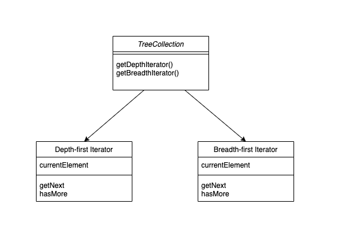

# Iterator Pattern

내부 구조를 노출하지 않고 컬렉션의 요소를 탐색할 수 있는 패턴
컬렉션의 순회 동작을 iterator 라는 별도의 객체로 추출




## 언제 사용?
- 컬렉션에 복잡한 데이터 구조가 있지만 클라이언트로부터 복잡성을 숨기려는 경우
- 컬렉션 순회 코드가 계속해서 반복될 때

## 장점과 단점
### 장점
- 단일 책임 원칙. 
    부피가 큰 순회 알고리즘을 별도의 클래스로 추출하여 클라이언트 코드와 컬렉션을 정리할 수 있음.
- 개방/폐쇄 원칙. 
    새로운 유형의 컬렉션이 추가되어도 iterator 만 변경하면 어플리케이션(클라이언트) 에는 변경사항이 전파되지 않음.
- 각 iterator 객체에는 자체 반복 상태가 포함되어 있으므로 동일한 컬렉션을 병렬로 반복 할 수 있음.


### 단점
- 애플리케이션이 하나의 컬렉션에서만 작동하는 경우 패턴을 적용하는 것은 과도한 작업이 될 수 있다.
- iterator 를 사용하는 것은 일부 특수 컬렉션의 요소를 직접 살펴 보는 것보다 덜 효율적일 수 있다.


## 예시
- java iterator
```java
ArrayList<Integer> list = new ArrayList<Integer>();
Iterator<Integer> itr = list.iterator();

while(itr.hasNext()) {
    list.get(itr.next());
}
```

```java

    /**
     * Returns an iterator over the elements in this list in proper sequence.
     *
     * <p>The returned iterator is <a href="#fail-fast"><i>fail-fast</i></a>.
     *
     * @return an iterator over the elements in this list in proper sequence
     */
    public Iterator<E> iterator() {
        return new Itr();
    }

    /**
     * An optimized version of AbstractList.Itr
     */
    private class Itr implements Iterator<E> {
        int cursor;       // index of next element to return
        int lastRet = -1; // index of last element returned; -1 if no such
        int expectedModCount = modCount;

        Itr() {}

        public boolean hasNext() {
            return cursor != size;
        }

        @SuppressWarnings("unchecked")
        public E next() {
            checkForComodification();
            int i = cursor;
            if (i >= size)
                throw new NoSuchElementException();
            Object[] elementData = ArrayList.this.elementData;
            if (i >= elementData.length)
                throw new ConcurrentModificationException();
            cursor = i + 1;
            return (E) elementData[lastRet = i];
        }

        public void remove() {
            if (lastRet < 0)
                throw new IllegalStateException();
            checkForComodification();

            try {
                ArrayList.this.remove(lastRet);
                cursor = lastRet;
                lastRet = -1;
                expectedModCount = modCount;
            } catch (IndexOutOfBoundsException ex) {
                throw new ConcurrentModificationException();
            }
        }

        @Override
        @SuppressWarnings("unchecked")
        public void forEachRemaining(Consumer<? super E> consumer) {
            Objects.requireNonNull(consumer);
            final int size = ArrayList.this.size;
            int i = cursor;
            if (i >= size) {
                return;
            }
            final Object[] elementData = ArrayList.this.elementData;
            if (i >= elementData.length) {
                throw new ConcurrentModificationException();
            }
            while (i != size && modCount == expectedModCount) {
                consumer.accept((E) elementData[i++]);
            }
            // update once at end of iteration to reduce heap write traffic
            cursor = i;
            lastRet = i - 1;
            checkForComodification();
        }

        final void checkForComodification() {
            if (modCount != expectedModCount)
                throw new ConcurrentModificationException();
        }
    }
```


