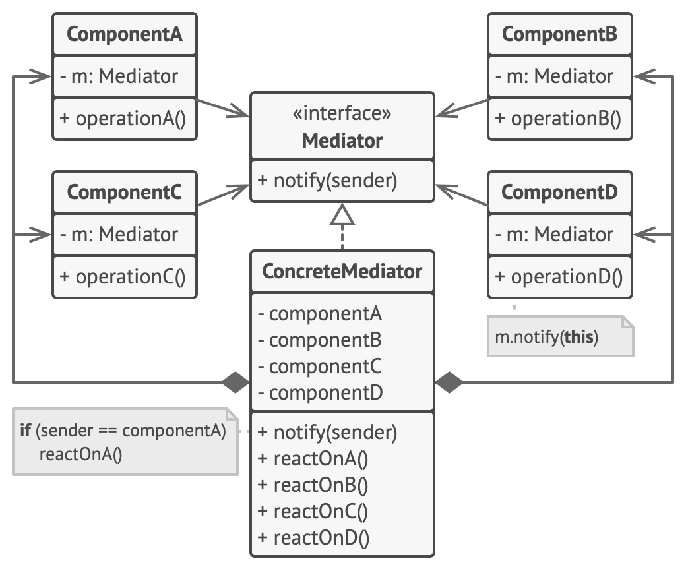
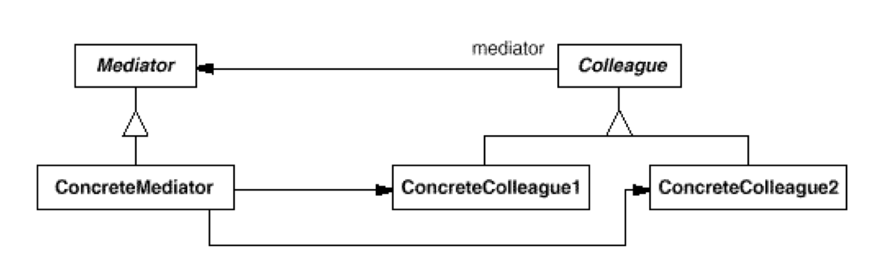
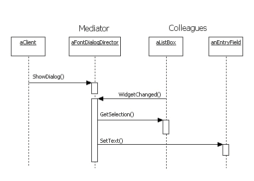
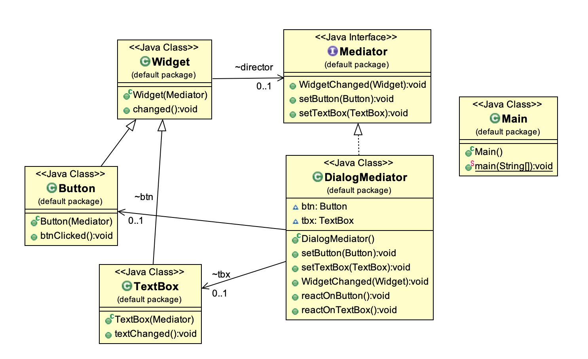
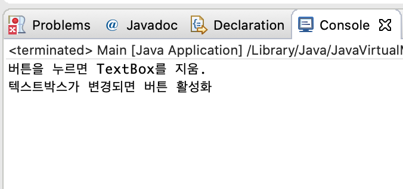

# Mediator Pattern

#### Mediator 패턴의 정의

------

* 한 집합에 속한 객체들 간 의사소통을 중재자 클래스를 통해 하게 함으로써, 객체들이 서로를 참조하지 않도록 해 결합성을 줄이는 패턴
* 동료객체 간 상호작용을 한 클래스에 몰아줌. (Mediator)






##### 중재자 클래스 - 동료객체 간 처리 순서



##### 중재자패턴의 클래스다이어그램



```java
public interface Mediator {
	public void WidgetChanged(Widget widget);
	public void setButton(Button btn);
	public void setTextBox(TextBox tbx);
}
```

```java
public class DialogMediator implements DialogDirector{

	Button btn;
	TextBox tbx;
	
	public void setButton(Button btn){
		this.btn = btn;
	}
	
	public void setTextBox(TextBox tbx){
		this.tbx = tbx;
	}
	
	@Override
	public void WidgetChanged(Widget widget) {
		// TODO Auto-generated method stub
		if(widget == btn){
			reactOnButton();
		}else if(widget == tbx){
			reactOnTextBox();
		}
	}

	public void reactOnButton(){
		System.out.println("버튼을 누르면 TextBox를 지움.");
	}
	
	public void reactOnTextBox(){
		System.out.println("텍스트박스가 변경되면 버튼 활성화");
	}
}
```

```java
public class Widget {
	
	DialogDirector director;
	
	public Widget(DialogDirector director){
		this.director = director;
	}
	
	public void changed() {
		director.WidgetChanged(this);
	} 
}
```

```java
public class Button extends Widget{
	public Button(DialogDirector director) {
		super(director);
		// TODO Auto-generated constructor stub
	}
	
	public void btnClicked(){
		changed();
	}
}
```

```java
public class TextBox extends Widget{

	public TextBox(DialogDirector director) {
		super(director);
		// TODO Auto-generated constructor stub
	}
	
	public void textChanged(){
		changed();
	}
}
```

```java
public class Main {
	public static void main(String[] args) {
		// TODO Auto-generated method stub
		 DialogDirector director = new FontDialogDirector();
     Button btn = new Button(director);
     TextBox tbx = new TextBox(director);
         
     director.setButton(btn);
     director.setTextBox(tbx);
         
     btn.btnClicked(); // 버튼 클릭
     tbx.textChanged(); // 텍스트 변경
   	}
}
```



#### Mediator 패턴의 장단점

------

* 서브클래싱을 제한
* Colleague 객체 사이의 종속성을 줄임
  * 서로가 서로를 의존하지 않도록 함.
* 객체 프로토콜 단순화
  * 다대다의 관계를 일대다 관계로 축소. 이해에도 좋고 확장이나 유지가 더 수월.
* 객체간 협력방법을 추상화
  * 중재자(객체간 의사소통 부분)의 역할을 독립적으로 분리하고, 캡슐화하여 Client는 객체의 행동에 관계없이 객체를 중재자 클래스와 연결하는 것에만 신경을 쓰면 됌.
* 통제의 집중화
  * 하나의 중재자 클래스에서 객체간 의사소통을 제어하고 있기 때문에 해당 클래스가 복잡해질 수 있음.

#### Mediator 패턴의 구현

------

* 추상클래스인 Mediator는 생략가능(서브클래싱 용도)
* Colleague-Mediator의 의사소통 방식
  * 감시자 패턴(주관자(Subject)인 Colleague 객체가 상태변화 시 Mediator에 통보, 중재자는 이를 관찰(Observe)하여 다른 Colleague들에 변경을 통보하여 처리.

#### Mediator 패턴과 관련패턴

------

- 퍼사드 패턴
  * 퍼사드의 경우, 객체들로 구성된 서브시스템들을 추상화해 복잡한 코드를 감춰 더 편한 인터페이스를 제공하려는 것으로, 중재자 패턴과 조금 다름.
  * 서브시스템 객체들로만 메세지 전달(퍼사드 객체로 메세지가 전달되지는 않음)
  * 중재자 패턴의 경우, 양방향 메세지 전달 가능.

#### Mediator 패턴의 예

------

Java Timer - scheduleXX() 함수

```java
TimerTask timerTask = new MyTimerTask();
//running timer task as daemon thread
Timer timer = new Timer(true);

timer.scheduleAtFixedRate(timerTask, 0, 10*1000);
```

