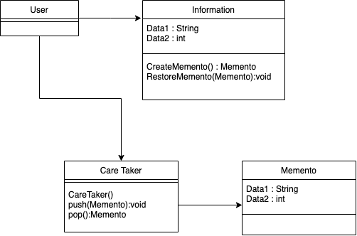

# Memento Pattern
Memento : 기억을 남길 수 있는 물건

객체의 특정 상태를 기억해두었다가 불러올 수 있는 패턴


## 언제 사용?
- 특정 시점의 객체 상태를 저장해둘 필요가 있을 때 : snapshot


## 기존 방식의 문제점
- 객체의 특정 상태를 저장하려면, 객체내부의 모든 값에 접근 가능해야 하므로 어떤식으로든 객체의 필드를 노출해주어야 한다.
   따라서 객체 필드가 노출되어있지 않은 경우에는 스냅샷을 생성할 수 없고,
   이를 위해 모든 필드를 노출시켜버리면 객체가 unsafe 해진다.
- 스냅샷 대상 객체가 리팩토링 등으로 변경되면 스냅샷을 생성하는 로직이 영향을 받는다.

## Memento Pattern 구현

- User : 메멘토 패턴이 적용 된 Information 객체 사용하는 클라이언트 
- Information : 스냅샷 대상 클래스
- Memento : 특정 시점의 Information 클래스를 저장하기 위한 클래스
- CareTaker : Memento 들을 관리하는 클래스. Stack 자료구조를 사용

*Memento 클래스는 변경 불가능해야 하며, Setter 를 가져서는 안된다. (생성자로만 초기화 가능)




```java
public class Information {
    private String data1;                            
    private int data2;                          

    public Information(String data1, int data2) {
        this.Data1 = data1;
        this.Data2 = data2;
    }

    public Memento createMemento() {                 // Memento 생성 (스냅샷 저장) 
        return new Memento(this.data1,this.data2);
    }

    public void restoreMemento(Memento memento) {      // Memento 복원 (스냅샷 복원)
        this.Data1 = memento.getData1();
        this.Data2 = memento.getData2(); 
    }

    // getters and setters
}
```

```java

public class Memento {
    
    //Information의 상태정보를 가지고 있음
    private String data1;
    private int data2;

    public Memento(String data1, String data2) {
        this.data1 = data1;
        this.data2 = data2;
    }

}
```

```java
public class CareTaker {
    
    Stack<Memento> mementos = new Stack<>();
    
    public void push(Memento memento) {        // 특정 시점에 생성된 Memento를 Push
        mementos.push(memento);
    }

    public Memento pop() {                     // Memento 객체 반환
        return mementos.pop();
    }
}
```

```java

public class User {

    Information info  = new Information("Data1",10);            //Information 객체 생성
    CareTaker careTaker = new CareTaker();  
    
    careTaker.push(info.createMemento());    // 스냅샷 생성

    info.setData1("Data2");
    info.setData2(20);
    // info : data2, 20

    info.restoreMemento(careTaker.pop());    // 스냅샷 복원 
    // info : data1, 10

}
        

```


OR

다른 방법.
restore 를 Memento 내부에 가짐으로써 Memento 가 가지고 있는 Information 의 상태데이터를 보호 (강한 캡슐화)


```java
public class Information {
    private String data1;                            
    private int data2;                          

    public Information(String data1, int data2) {
        this.data1 = data1;
        this.data2 = data2;
    }

    public Memento CreateMemento() {                 // Memento 생성 (스냅샷 저장) 
        return new Memento(this, this.Data1,this.Data2);
    }

    // setters 
}
```

```java

public class Memento {
    
    private Information information;

    //Information의 상태정보를 가지고 있음
    private String data1;
    private int data2;

    public Memento(Information information, String data1, int data2) {
        this.information = information;
        this.Data1 = data1;
        this.Data2 = data2;
    }

    public void restoreMemento() {      // Memento 복원 (스냅샷 복원)
        information.setData1(Data1);
        information.setData2(Data2);
    }
}
```

```java


public class User {

    Information info  = new Information("Data1",10);            //Information 객체 생성
    CareTaker careTaker = new CareTaker();  
    
    careTaker.push(info.createMemento());    // 스냅샷 생성

    info.setData1("Data2");
    info.setData2(20);
    // info : data2, 20

    careTaker.pop().restoreMemento();    // 스냅샷 복원 
    // info : data1, 10

}

```


## Memento Pattern 장점
- 객체가 직접 자신의 스냅 샷을 생성한다. 따라서 다른 객체는 스냅샷을 읽을 수 없으므로 원본 객체의 상태 데이터를 안전하게 보호한다. (캡슐화)
- 스냅샷을 생성/복원하는 코드가 심플해진다.


## Memento Pattern 단점
- 너무 많은 Memento 를 생성할 경우 RAM 부족 문제가 생길 수 있다.
- Memento 생명주기를 반드시 추적해야 한다. (오래된 Memento 제거)
