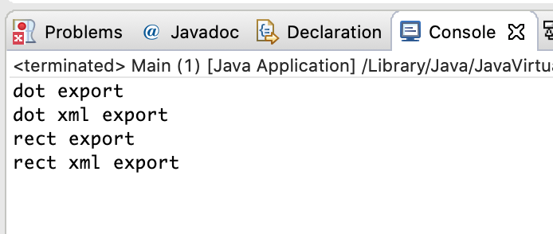

# Visitor Pattern

#### Visitor 패턴의 정의

------

* 연산을 가진 클래스가 적용할 객체를 방문하며 연산을 수행하는 패턴
  * 관련된 연산들을 하나의 클래스(방문자)로 몰아놓고, 적용할 객체를 이 클래스가 방문하며 연산을 수행한다.

##### 사용하는 이유

* 객체구조를 정의한 기존 클래스 자체는 거의 변하지 않고, 전체 구조에 걸쳐 새로운 연산이 추가되는 일이 잦을 때
* 객체구조에 필요한 연산들이 서로 연관이 없으며, 이렇게 연산으로 기존 클래스를 어지럽히고 싶지 않을 때


##### 각 요소별 특징

* ObjectStructure
  * 방문자가 Element 에 접근하게 하는 상위 수준의 인터페이스를 제공함. 
  * Composite 객체일 수도 있고, Collection 일 수도 있음. 어떤 것이든 올 수 있음.
* Element
  *  방문자를 인자로 받아들이는 Accept 연산을 구현함.
* Visitor
  * 각 Element에 대한 연산을 선언함. Element의 갯수만큼 함수를 선언.

##### 이중 디스패치의 원리

* 런타임에 어떤 연산을 수행할지 결정하는데, 두 가지 이상의 타입에 따라 해당 연산이 결정.

#### Visitor 예제


```java
public interface Shape {
	void accept(Visitor v);
}
```

```java
public class Dot implements Shape{
	@Override
	public void accept(Visitor v) {
		// TODO Auto-generated method stub
		v.visit(this);
	}
}


public class Rectangle implements Shape{
	@Override
	public void accept(Visitor v) {
		// TODO Auto-generated method stub
		v.visit(this);
	}
}
```

```java
public interface Visitor {
	public void visit(Dot dot);
	public void visit(Rectangle rect);
}
```

```java
public class ExportVisitor implements Visitor{
	@Override
	public void visit(Dot dot) {
		// TODO Auto-generated method stub
		// 원의 센터 좌표를 export 한다.
		System.out.println("dot export");
	}

	@Override
	public void visit(Rectangle rect) {
		// TODO Auto-generated method stub
		// 사각형의 id, width 와 height 를 export 한다.
		System.out.println("rect export");
	}
}


public class XmlExportVisitor implements Visitor{
	@Override
	public void visit(Dot dot) {
		// 원의 센터 좌표를 xml로 export 한다.
		System.out.println("dot xml export");
	}

	@Override
	public void visit(Rectangle rect) {
		// 사각형의 id, width 와 height 를 export 한다.
		System.out.println("rect xml export");
	}
}
```

```java
public class Main {

	public static void main(String[] args) {
		// TODO Auto-generated method stub
		Visitor visitor = new ExportVisitor();
		Visitor xmlVisitor = new XmlExportVisitor();
		
		Shape dot = new Dot();
		Shape rect = new Rectangle();
		
		dot.accept(visitor); 
		dot.accept(xmlVisitor);
		rect.accept(visitor);
		rect.accept(xmlVisitor);
	}
}
```



#### Visitor 패턴의 장단점

------

* 장점
  * 새로운 연산을 쉽게 추가할 수 있음.(새로운 방문자 클래스를 만드는 형식으로)
  * 연산을 한군데로 모을 수 있고, 객체구조의 속성과 관련되지 않은 연산을 떼어낼 수 있음.
  * 원소를 순회하며 부가적인 정보를 축적할 수 있음.
  * 개방/폐쇄 원칙, 단일책임원칙
* 단점
  * 새로운 Element 추가/삭제는 어려움(방문자 클래스를 모두 수정해야만 함.)
  * 데이터 은닉을 깸.

#### Visitor 패턴의 구현시 고려할 점

------

* 이중 디스패치
  * 런타임에 어떤 연산을 수행할지 결정하는데, 두 가지 이상의 타입에 따라 해당 연산이 결정.
  * 실제 실행되는 연산은, Visitor 타입과 그것이 방문하는 Element 타입에 따라 달라지게 됌.
  * 연산과 Element는 정적 바인딩을 하지만, Visitor내 연산을 한 군데로 모으고 Accept를 이용해 런타임에 바인딩을 진행
* 객체구조의 순회
  * 객체구조 / 반복자 / 방문자에 책임을 맡길 수 있음.

#### Visitor 관련 패턴

------

- 복합체패턴
  * 복합체 패턴의 원소 방문 시 Visitor 사용 가능

```java
class CompositeElement {
	public void Accept(){
		for(...){
			원소.accept();
		}
		v.visitCompositeElement();
	}
}
```

- 해석자패턴
  - 해석자의 해석과정에서 Visitor를 사용 가능
  - 프로그래밍 언어에 대한 문법은 타입점검, 최적화 코드 생성 등 여러가지 연산이 있는데, 해당 연산들을 방문자 패턴으로 구현.
