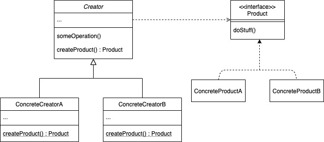
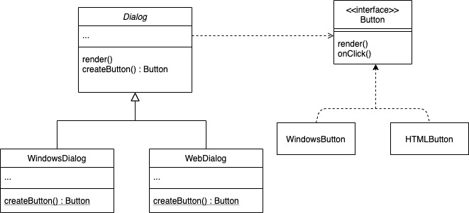

# Factory Method Pattern

**객체를 생성하는** 역할을 서브클래스에 위임하여 비지니스 로직과 분리하는 패턴.
특정 객체를 생성해 리턴해주는 메소드를 `팩토리 메소드` 라고 한다.

객체를 생성할 `팩토리 메소드`를 인터페이스(또는 추상클래스)에 정의하고, 서브 클래스에서 이를 오버라이드해 특정 객체를 생성하여 리턴한다. 


---

## 왜 사용할까?
**객체를 사용하려는 쪽(클라이언트) - 객체 타입**  간의 의존성 제거.
클라이언트에서 직접 대상 객체를 생성하게 될 경우, 생성하려는 대상 객체의 종류를 모두 알고 있어야 함. 대상 객체가 바뀌거나 추가될 경우 클라이언트 수정이 필요하다.
따라서, 클라이언트에서는 인터페이스에만 의존하고, 서브클래스에서 객체의 생성을 담당한다.

---



**Creator**
객체를 생성할 팩토리 메소드(createProduct) 정의. 
이 메소드의 반환 유형이 Product 타입이여야 함.
Creator 클래스는 추상 클래스로 정의하여, 팩토리 메소드 내부를 구현하지 않고 서브클래스에서 구현하도록 함. (기본 객체를 리턴하도록 구현하는 경우도 있음)
하지만 팩토리 메소드를 통한 객체 생성이 Creator 의 주요 책임은 아님!
객체와 관련된 핵심 비지니스 로직(someOperation)을 가지고 있으며, 이 객체의 생성을 팩토리 메소드를 통해 분리하는 것이 목적이다.

**Product**
생성될 객체에 대한 타입을 정의 

**Concrete Creator**
기본 팩토리 메소드를 재정의하여 다른 유형의 Product 를 반환.

팩토리 메소드는 항상 새 인스턴스를 생성할 필요가 없다. 재사용 가능. (cf. Singleton 패턴)


---
## 예제



```java
abstract class Dialog {
    public abstract Button createButton();

    public void render() {
        Button okButton = createButton()
        // Now use the product.
        okButton.onClick()
        okButton.render()
    }

}
```

```java
class WindowsDialog extends Dialog {

    @Override
    public Button createButton() {
        return new WindowsButton();
    }
}
```
```java
class WebDialog extends Dialog {

    @Override
    public Button createButton() {
        return new HTMLButton();
    }
}
```

```java
interface Button {
    void render();
    void onClick();
}
```
```java
class WindowsButton implements Button {
    // override methods
}
```
```java
class HTMLButton implements Button {
    // override methods
}
```

```java
class Main {

    private Dialog dialog;

    public void static main(String[] args) {
        this.init();
        dialog.render();
    }

    private void init() {
        type = getTypeFromConfig();

         switch(type) {
            case WINDOWS: return new WindowsDialog();
            case WEB: return new WebDialog();
        }
        throw new NotSuppertedException();
    }
}
```

---
**간소화된 버전 (Dialog 제거)**

```java
abstract class Button {
    void render();
    void onClick();

    public static Button createButton(ButtonType type) {
        switch(type) {
            case WINDOWS: return new WindowsButton();
            case WEB: return new HTMLButton();
        }
        throw new NotSuppertedException();
    }
}
```
```java
class WindowsButton implements Button {
    // override methods
}
```
```java
class HTMLButton implements Button {
    // override methods
}
```

```java
class Main {

    private Button button;

    public void static main(String[] args) {
        button = Button.createButton(getTypeFromConfig());
        button.onClick();
        button.render();
    }

}
```
---
### 장점과 단점

**장점** 
 클라이언트와 구체적인 제품 간의 긴밀한 결합을 피한다. 

 단일 책임 원칙. 
 제품 생성 코드를 한 곳에서 책임진다.
 
 개방/폐쇄 원칙.
 기존 클라이언트 코드를 손상시키지 않고 새로운 유형의 제품을 프로그램에 도입 할 수 있다.

**단점**
객체 유형이 늘어날 때마다 서브클래스를 추가해야 하므로 클래스가 많아지고 코드가 더 복잡해 질 수 있다.

---
### 연관된 패턴들
Abstract Factory Pattern
Template Method Pattern

---
참고
https://refactoring.guru/design-patterns/factory-method
