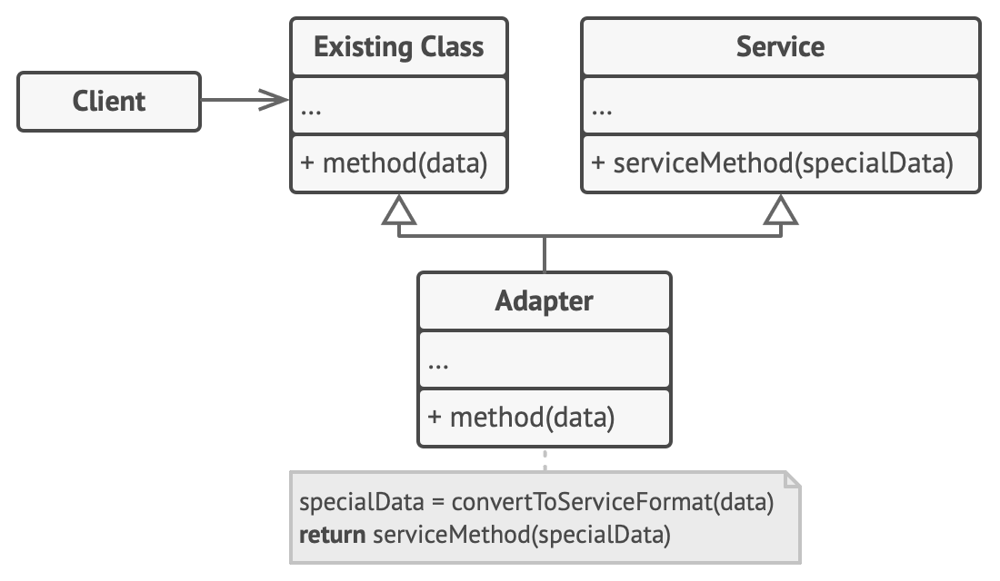
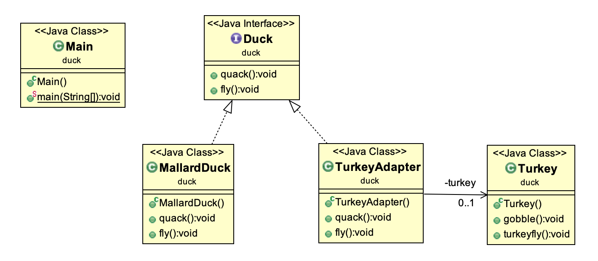
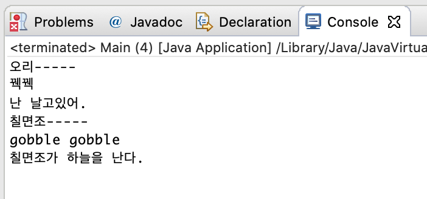
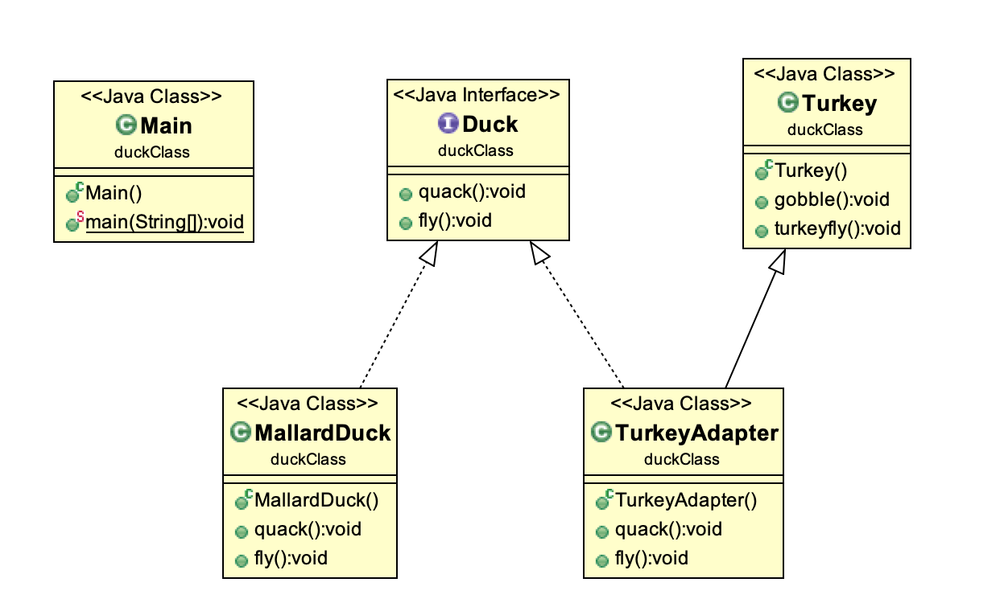
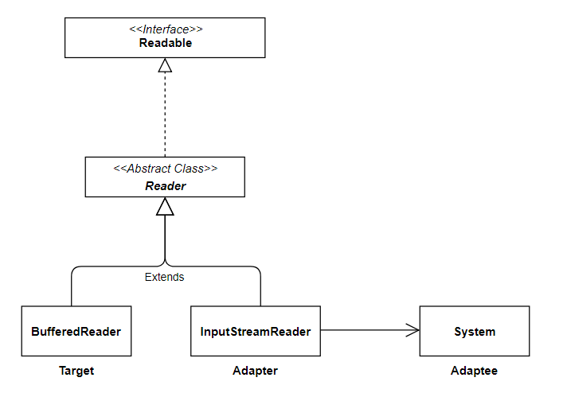

# Adapter Pattern

#### Adapter의 정의

------

- 함께 사용할 수 없는 클래스를 함께 사용할 수 있도록 변환해주는 패턴. 맞지 않는 것을 맞을 수 있도록 '변환'해주는 역할을 하는 것이 어댑터

- 사용하고자 하는 2개의 클래스가 있을 때, 이를 변환하여 사용하고 싶을 때 유용한 패턴

#### Adapter 패턴 종류

------

##### Class 버전

##### 

- 양립불가능한 두가지의 클래스가 있다면, 해당 클래스를 두개 다 상속하여 구현 가능. (단, 다중상속 가능한 언어 사용해야 함)
- Adapter클래스의 경우, Adaptee클래스를 상속하는 서브클래스를 사용하는 것은 불가능
- Adaptee클래스를 상속하기 때문에, Adaptee에 정의된 행동(위의 예 : serviceMethod)을 Override 하기 쉬움.

##### Object 버전


- Adapter클래스는 Adaptee클래스의 객체를 정의하고, 이를 통해 Adaptee의 객체를 사용하는 방식으로 구현
- Adapter클래스의 경우, Adaptee 클래스 및 이를 상속하는 서브클래스를 모두 사용 가능(Adaptee객체를 통해 서브클래스의 메소드 사용 가능)
- 상속을 받은 것은 아니기 때문에, Adaptee클래스를 Override 하기 어렵다. 변경하려면 Adaptee를 상속받는 클래스 인스턴스를 따로 만들고, Adaptee 클래스 변수가 이를 참조하도록 변경하여야 한다.

#### Adapter 패턴 예시

##### Object 버전



* Duck

```java
public interface Duck{
	public void quack(); // 오리 울리기
	public void fly(); // 오리 날기
}
```

* MallardDuck

```java
public class MallardDuck implements Duck{
	@Override
	public void quack() {
		// TODO Auto-generated method stub
		System.out.println("꿱꿱");
	}
  
	@Override
	public void fly() {
		// TODO Auto-generated method stub
		System.out.println("난 날고있어.");
	}
}
```

* Turkey

```java
public class Turkey {
	public void gobble(){
		System.out.println("gobble gobble"); // 칠면조 울리기
	}

	public void turkeyfly(){
		System.out.println("칠면조가 하늘을 난다."); // 칠면조 날기
	}
}
```

* TurkeyAdapter

```java
public class TurkeyAdapter implements Duck{
	
	private Turkey turkey = new Turkey();
	
	@Override
	public void quack() {
		// TODO Auto-generated method stub
		turkey.gobble();
	}

	@Override
	public void fly() {
		// TODO Auto-generated method stub
		turkey.turkeyfly();
	}
}
```

* Main

```java
public class Main {

	public static void main(String[] args) {
		// TODO Auto-generated method stub
		Duck duck = new MallardDuck();
		Duck duckAdapter = new TurkeyAdapter();
    
		System.out.println("오리-----");
		duck.quack();
		duck.fly();
		
		System.out.println("칠면조-----");
		duckAdapter.quack();
		duckAdapter.fly();
	}
}
```



##### Class 버전

##### 

* TurkeyAdapter

```java
public class TurkeyAdapter extends Turkey implements Duck{

	@Override
	public void quack() {
		// TODO Auto-generated method stub
		gobble(); // 칠면조 우는 소리
	}

	@Override
	public void fly() {
		// TODO Auto-generated method stub
		turkeyfly(); // 칠면조 하늘날기
	}
}
```

#### Adapter패턴의 구현 시 고려사항

* 적응이 필요한 연산의 최소집합을 만든다. <u>**한 두개의 연산만을 변환시키는 것이 더 쉽기 때문**</u>
* **대체가능(Pluggable) Adapter **: 쉽게 꽂았다가 뺄 수 있는 Adapter
  * 이미 존재하는 클래스를 수정하지 않고(재사용하지 않고), Adapter클래스를 만들어 기능을 확장
  * 서로 다른 인터페이스를 갖는 여러개의 구조라고 하더라도, Adapter클래스를 두어 원하는 형태로 개조 가능.
  * 그냥 Adapter패턴의 경우, 사용하고자 하는 인터페이스가 기존 인터페이스와 호환되지 않을 때 이를 변환해주는 데에 초점을 맞추나, Pluggable Adapter패턴의 경우, 다양한 형태의 인터페이스들이 자신이 어떻게 구현되어있는지에 대해 신경쓰지 않아도 되도록 해줌.
  * ex) TreeDisplay 위젯을 구현하고자 하는데, 어떤 클래스는 계층구조로 되어있고, 어떤 클래스는 폴더구조로 되어있음. 하지만, 이 두가지의 구조 모두 트리 형태로 보여져야 하는 상황.
  * Adapter 패턴을 적용하여 이 두가지의 클래스가 Tree 클래스를 상속하거나, 구현을 바꾸지 않더라도 Tree형태로 보여지도록 할 수 있음.
* 양방향적응자
  * Target 클래스, Adaptee 클래스의 인터페이스를 모두 상속받아 정의

#### Adapter패턴의 구현방법

* 클래스 적응자(C++로 구현)

  * Target은 public, Adaptee는 private 으로 상속하여, Adaptee클래스를 Client에게 숨길 수 있도록.

* **대체가능(Pluggable) Adapter**

  * (a) 추상연산을 이용

  .png)

  

  * (b) 위임객체를 이용

    .png)

  * (c) 매개변수화된 Adapter사용

#### Adapter 패턴의 장점과 단점

##### 장점

* 단일책임원칙 - 클라이언트 코드에 비즈니스로직과 변환로직을 분리해낼 수 있다.

* 개방폐쇄 원칙 - 기존 메인 로직의 수정은 막고, 새로운 어댑터를 추가하여 기능을 확장할 수 있다.

##### 단점

* Target 인터페이스가 커지게 된다면, Adapter또한 필연적으로 커질 수 밖에 없음.
* Java의 경우, 다중상속을 지원하지 않기 때문에 무조건 하나 이상은 Interface로 구현해야 함.

* 클래스 Adapter의 경우, 상속을 사용하므로 유연하지 못함.

#### Adapter 패턴 사용사례

* InputStreamReader



```java
BufferedReader br = new BufferedReader(new InputStreamReader(is, "UTF-8"));
```

