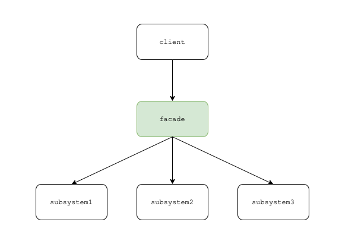

# Facade Pattern


건물의 정면이라는 뜻.
건물 정면이 건물 내부를 가려주듯이, 서브시스템 내부의 복잡한 기능은 숨긴 채 서브시스템을 사용할 수 있는 interface 만 제공하는게 facade.



클라이언트에서 서브시스템들을 일일히 다룰 필요가 없고 facade 만 알고 있으면 된다.


## 특징
- 느슨한 결합 (모듈간 결합도, 의존성 down)
- 복잡성 감소
- 최소 지식 원칙 (객체와 상호작용 하는 클래스를 최소화)
- 계층 구조 (관심사를 분리하여 퍼사드를 여러개 만들 수 있음)


## 왜 쓰나?
- 복잡한 서브시스템에 대한 의존도 줄일 수 있음
- 복잡한 서브시스템 추상화/단순화 하여 사용할 수 있음
- 서드파티 API 등 외부 라이브러리를 추상화해서 사용할 수 있음 (외부 라이브러리가 변경되어도 facade 에만 영향을 끼침)


## 다른 패턴과의 비교
- 어댑터 패턴 : 객체를 감싸서 인터페이스를 변경하고자 할 때
- 데코레이터 패턴 : 객체를 감싸서 새로운 행동을 추가하고자 할 때
- 퍼사드 패턴 : 일련의 객체를 감싸서 단순화하고자 할 때

## 예제

```java
// submodules 

class VideoFile
// ...

class OggCompressionCodec
// ...

class MPEG4CompressionCodec
// ...

class CodecFactory
// ...

class BitrateReader
// ...

class AudioMixer
// ...


```


```java
// facade class
class VideoConverter {
    ...
    public File convert(String fileName, String format) {
        VideoFile file = new VideoFile(filename)
        sourceCodec = new CodecFactory.extract(file)
        if (format == "mp4")
            destinationCodec = new MPEG4CompressionCodec();
        else
            destinationCodec = new OggCompressionCodec();
        buffer = BitrateReader.read(filename, sourceCodec)
        result = BitrateReader.convert(buffer, destinationCodec)
        result = (new AudioMixer()).fix(result)
        return new File(result)
    }
}
```


```java
// 수많은 subclass 에 의존할 필요 없이, facade 클래스에만 의존
class Application {
    public static void main(String[] args) {
        convertor = new VideoConverter()
        mp4 = convertor.convert("funny-cats-video.ogg", "mp4")
        mp4.save()
    }
}    

```