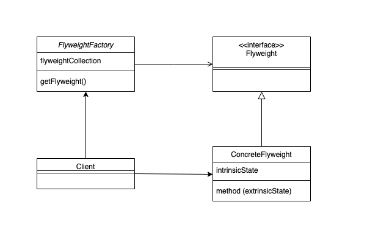

# Flyweight Pattern

객체를 공유하기 위해 구조를 변경하는 패턴.

## 언제 사용?
- 매우 많은 수의 유사한 객체를 생성해야 할 떄
- 해당 작업으로 인해 RAM 이 부족할 가능성이 있을 때
- 유사한 객체들 사이에 추출 및 공유할 수 있는 상태가 포함되어 있을 때
- 객체 생성 비용이 큰데, 사용 빈도는 낮은 경우


## 특징

- 객체를 공유하여 시스템 자원을 절약 (메모리)
- 팩토리 클래스를 사용할 수 있음
    플라이웨이트 풀을 관리 할 팩토리 클래스.
    팩토리 클래스에서는 새로운 플라이웨이트 객체를 만들기 전에 기존 플라이웨이트 객체가 있는지 확인한다. (중복생성 방지)
- 공유되는 객체에는 상태가 없어야 함


```java
class FlyweightFactory{

    Map<String, Flyweight> map = new HashMap<String, Flyweight>();

    public Subject getFlyweight(String name){
        Flyweight flyweight = map.get(name);

        if(flyweight == null){
            flyweight = new Flyweight(name);
            map.put(name, flyweight);
        }

        return flyweight;
    }
}


class Flyweight{

    private String name;

    public Flyweight(String name){
        this.name = name;
        System.out.println("create : " + name);
    }

}

```

client
```java
public static void main(String[] args) {

    FlyweightFactory flyweightFactory = new FlyweightFactory();

    flyweightFactory.getFlyweight("a");
    flyweightFactory.getFlyweight("a");
    flyweightFactory.getFlyweight("b");
    flyweightFactory.getFlyweight("b");
}

```

### 플라이웨이트 객체 상태 관리법
플라이웨이트 객체는 두 가지 상태를 가질 수 있다.
- 고유 상태 : 객체들간 공유되는, 변하지 않는 데이터 필드 (intrinsicState)
- 외부 상태 : 각 객체에 고유한 컨텍스트 데이터를 가진 필드 (extrinsicState)

**고유 상태**는 객체안에 두되 **변경 불가능** 해야한다. (setter 노출 금지, 생성자 내에서 초기화 가능)

**외부 상태**는 상태를 관리할 별도의 컨텍스트 클래스를 생성해 사용해야 한다.
(해당 클래스에 플라이웨이트 참조 필드 포함)
-> 이렇게 해도 각 컨텍스트 클래스는 플라이웨이트 객체의 **참조**만 포함하기 때문에 플라이웨이트 객체를 여러개 생성하는 것보다는 메모리가 절약된다.


## 장점과 단점
### 장점
- RAM 절약

### 단점
- 대신 CPU 사용량이 늘 수 있음
- 코드 복잡도 증가


## 예시
- java String class
```java
public static void main(String[] args){
    String s = "hello";
    String s1 = new String("hello");
    String s2 = "hello";
 
    System.out.println("s == s1 ? " + (s == s1));
    System.out.println("s == s2 ? " + (s == s2));
 }
   
 //result
 s == s1 ? false
 s == s2 ? true
```
java 에서는 String literal 객체에 대해 String pool 을 사용하여, 바로 객체를 생성하지 않고 기존 pool 을 검사하여 중복된 객체가 없을 때만 생성한다.


- connection pool, thread pool
